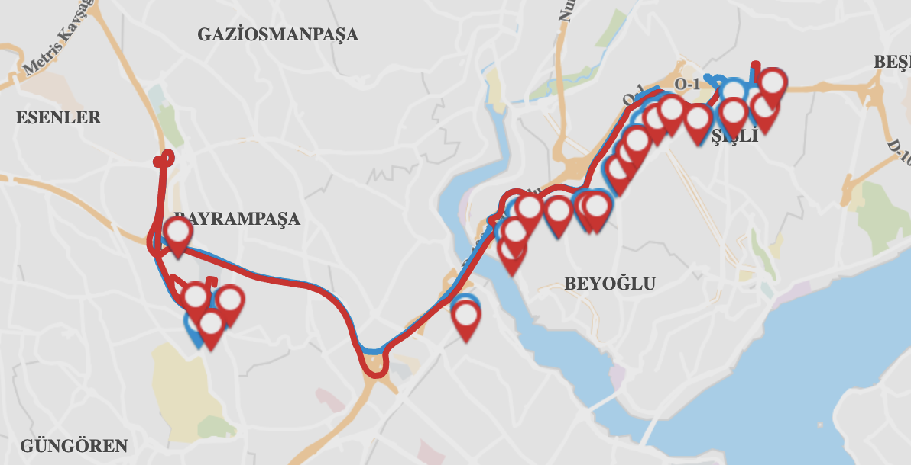

# IBB-Internship

This repository contains the daily number of trips and bus departure times that I optimized for the 75-O IETT bus line, which I worked on during my internship at Istanbul Metropolitan Municipality (IBB). The most appropriate bus schedule was created using daily passenger movement data from the stops on the route.

First of all, the 75-O line, which does not have many trips in Istanbul and is generally used to go to the intercity bus terminal, was chosen as the route of the project for closer examination. The route continues in both directions between Bus Terminal and Mecidiyeköy, with different numbers of trips 7 days a week. If you would like to take a closer look, you can view the current sailing schedule [here](https://iett.istanbul/RouteDetail?hkod=75O&routename=OTOGAR%20-%20MEC%C4%B0D%C4%B0YEK%C3%96Y). Below is the 75-O route.

The aim of the project is to find the three most suitable new schedules for the line, which has three different schedules: weekdays, Saturdays, and Sundays. In this project, 75-O passenger card printing data for the first 8 months of 2023 was used as the data set. In order to estimate the voyage density, which is the aim of the project, each stop movement and transfer on the route were examined in detail. The data set processed for the project will not be shared for confidentiality reasons. The current voyage table is as follows:

The following topics were analyzed throughout the project process:

1 - Passenger Profile
2 - Distribution of Daily and Monthly 75-O Users
3 - Density of Stops on the Route
4 - Estimated Number of Bus Trips

Finally, Poission Distribution was used as a solution technique to optimally adjust the statistical distribution of passengers' boarding times for estimating the number and time of flights. As a result, the following actions were taken:Finally, Poission Distribution was used as a solution technique to optimally adjust the statistical distribution of passengers' boarding times for estimating the number and time of flights. As a result, the following actions were taken:

5 - Bus Departure Time Estimation
6 - Seasonal (Special Forecast for Busiest and Least Busy Seasons) Number of Trips Forecast

You can find the details of these reviews in the code file and the report file prepared for the summary of the project. 
